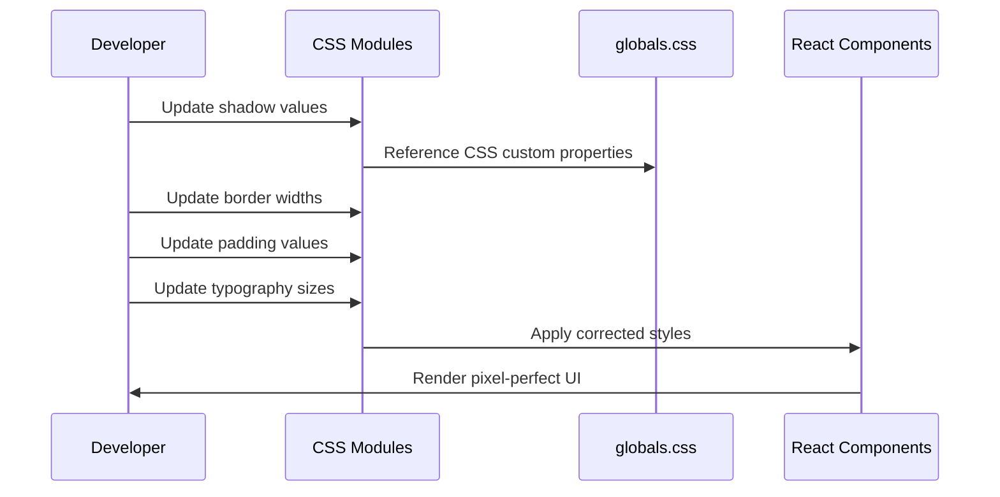
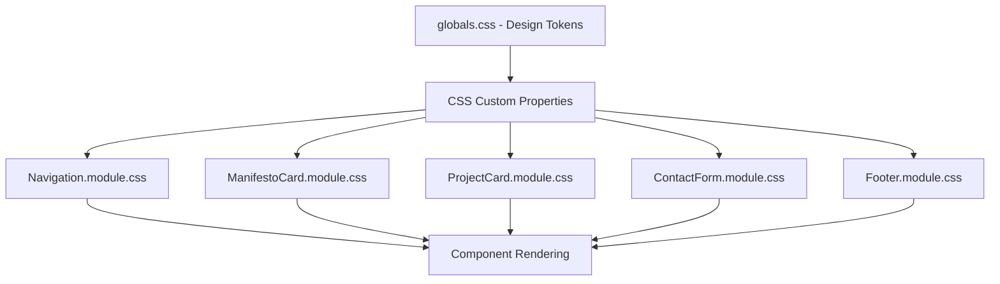

# Design Document: Pixel-Perfect HTML Parity

## Overview

This feature achieves exact visual matching between the Next.js implementation and the original HTML files in the Html folder. The design focuses on correcting specific CSS values for shadows, borders, typography, padding, and hover effects to ensure pixel-perfect parity with the original brutalist design specifications.

## Main Algorithm/Workflow



## Architecture

The styling corrections are organized into distinct layers:



## Core Interfaces/Types

```typescript
interface ShadowValues {
  brutalShadowSm: string;  // 4px 4px 0px 0px #000000
  brutalShadow: string;    // 8px 8px 0px 0px #000000
  brutalShadowHover: string; // 12px 12px 0px 0px #000000
}

interface NavigationStyles {
  activeLinkUnderlineOffset: string; // 8px
  activeLinkThickness: string;       // 4px
}

interface ManifestoCardStyles {
  padding: string;           // 3rem (48px)
  numberSize: string;        // 6rem (96px)
  numberOpacity: number;     // 0.1
  numberOpacityHover: number; // 1.0
}

interface ProjectCardStyles {
  borderWidth: string;       // 4px
  shadowDefault: string;     // 8px 8px 0px 0px #000000
  shadowHover: string;       // 12px 12px 0px 0px #000000
  hoverTransform: string;    // translate(-4px, -4px)
}

interface ContactFormStyles {
  fieldBorderWidth: string;  // 4px
  inputSizeMobile: string;   // 2.25rem (text-4xl)
  inputSizeDesktop: string;  // 3rem (text-5xl)
}

interface FooterStyles {
  backgroundColor: string;   // #f5f5f4 (stone-100)
  linkHoverEffect: string;   // italic + scale(1.05)
}
```

## Key Functions with Formal Specifications

### Function 1: updateShadowValues()

```typescript
function updateShadowValues(element: HTMLElement, shadowType: 'sm' | 'default' | 'hover'): void
```

**Preconditions:**
- `element` is a valid DOM element
- `shadowType` is one of: 'sm', 'default', 'hover'

**Postconditions:**
- Element has correct box-shadow applied
- Shadow values match original HTML specifications
- No side effects on other CSS properties

**Loop Invariants:** N/A

### Function 2: applyNavigationActiveStyles()

```typescript
function applyNavigationActiveStyles(link: HTMLAnchorElement): void
```

**Preconditions:**
- `link` is a valid anchor element
- Link is marked as active in navigation

**Postconditions:**
- Underline offset is exactly 8px
- Underline thickness is exactly 4px
- Text decoration is applied correctly

**Loop Invariants:** N/A

### Function 3: updateManifestoCardPadding()

```typescript
function updateManifestoCardPadding(card: HTMLElement): void
```

**Preconditions:**
- `card` is a valid manifesto card element

**Postconditions:**
- Padding is exactly 3rem (48px) on all sides
- Number size is 6rem (96px)
- Opacity transitions work correctly

**Loop Invariants:** N/A

### Function 4: applyProjectCardHoverEffect()

```typescript
function applyProjectCardHoverEffect(card: HTMLElement, isHovering: boolean): void
```

**Preconditions:**
- `card` is a valid project card element
- `isHovering` is a boolean value

**Postconditions:**
- On hover: shadow is 12px 12px, transform is translate(-4px, -4px)
- On default: shadow is 8px 8px, no transform
- Border width remains 4px

**Loop Invariants:** N/A

### Function 5: updateContactFormInputSizes()

```typescript
function updateContactFormInputSizes(input: HTMLInputElement, viewport: 'mobile' | 'desktop'): void
```

**Preconditions:**
- `input` is a valid input element
- `viewport` is either 'mobile' or 'desktop'

**Postconditions:**
- Mobile: font-size is 2.25rem (text-4xl)
- Desktop: font-size is 3rem (text-5xl)
- Border width is 4px

**Loop Invariants:** N/A

## Algorithmic Pseudocode

### Main Styling Correction Algorithm

```pascal
ALGORITHM applyStylingCorrections()
INPUT: none
OUTPUT: Updated CSS files with corrected values

BEGIN
  // Step 1: Update shadow system in globals.css
  ASSERT shadowValuesExist()
  
  updateCSSVariable('--shadow-brutal-sm', '4px 4px 0px 0px #000000')
  updateCSSVariable('--shadow-brutal', '8px 8px 0px 0px #000000')
  updateCSSVariable('--shadow-brutal-hover', '12px 12px 0px 0px #000000')
  
  ASSERT shadowValuesCorrect()
  
  // Step 2: Update navigation active link styles
  updateNavigationCSS({
    underlineOffset: '8px',
    underlineThickness: '4px'
  })
  
  // Step 3: Update manifesto card styles
  updateManifestoCardCSS({
    padding: '3rem',
    numberSize: '6rem',
    numberOpacity: '0.1',
    numberOpacityHover: '1.0'
  })
  
  // Step 4: Update project card styles
  updateProjectCardCSS({
    borderWidth: '4px',
    shadowDefault: '8px 8px 0px 0px #000000',
    shadowHover: '12px 12px 0px 0px #000000',
    hoverTransform: 'translate(-4px, -4px)'
  })
  
  // Step 5: Update contact form styles
  updateContactFormCSS({
    fieldBorderWidth: '4px',
    inputSizeMobile: '2.25rem',
    inputSizeDesktop: '3rem'
  })
  
  // Step 6: Update footer styles
  updateFooterCSS({
    backgroundColor: '#f5f5f4',
    linkHoverEffect: 'italic scale(1.05)'
  })
  
  ASSERT allStylesMatchOriginalHTML()
  
  RETURN success
END
```

**Preconditions:**
- All CSS module files exist
- globals.css exists with CSS custom properties
- Original HTML files are available for reference

**Postconditions:**
- All shadow values match original HTML
- All border widths match original HTML
- All padding values match original HTML
- All typography sizes match original HTML
- All hover effects match original HTML

**Loop Invariants:** N/A

### Shadow Value Update Algorithm

```pascal
ALGORITHM updateShadowValues(element, shadowType)
INPUT: element of type HTMLElement, shadowType of type String
OUTPUT: element with updated box-shadow

BEGIN
  ASSERT element IS NOT NULL
  ASSERT shadowType IN ['sm', 'default', 'hover']
  
  IF shadowType = 'sm' THEN
    element.style.boxShadow ← '4px 4px 0px 0px #000000'
  ELSE IF shadowType = 'default' THEN
    element.style.boxShadow ← '8px 8px 0px 0px #000000'
  ELSE IF shadowType = 'hover' THEN
    element.style.boxShadow ← '12px 12px 0px 0px #000000'
  END IF
  
  ASSERT element.style.boxShadow IS VALID
  
  RETURN element
END
```

**Preconditions:**
- element is a valid DOM element
- shadowType is one of the three valid values

**Postconditions:**
- Element has correct box-shadow value applied
- Shadow matches original HTML specification

**Loop Invariants:** N/A

### Navigation Active Link Styling Algorithm

```pascal
ALGORITHM applyNavigationActiveStyles(link)
INPUT: link of type HTMLAnchorElement
OUTPUT: link with active styling applied

BEGIN
  ASSERT link IS NOT NULL
  ASSERT link.classList.contains('active')
  
  link.style.textDecoration ← 'underline'
  link.style.textDecorationThickness ← '4px'
  link.style.textUnderlineOffset ← '8px'
  link.style.color ← '#000000'
  
  ASSERT link.style.textUnderlineOffset = '8px'
  ASSERT link.style.textDecorationThickness = '4px'
  
  RETURN link
END
```

**Preconditions:**
- link is a valid anchor element
- link has 'active' class

**Postconditions:**
- Underline offset is exactly 8px
- Underline thickness is exactly 4px
- Color is black (#000000)

**Loop Invariants:** N/A

### Project Card Hover Effect Algorithm

```pascal
ALGORITHM applyProjectCardHoverEffect(card, isHovering)
INPUT: card of type HTMLElement, isHovering of type Boolean
OUTPUT: card with hover effect applied or removed

BEGIN
  ASSERT card IS NOT NULL
  
  IF isHovering = TRUE THEN
    card.style.boxShadow ← '12px 12px 0px 0px #000000'
    card.style.transform ← 'translate(-4px, -4px)'
  ELSE
    card.style.boxShadow ← '8px 8px 0px 0px #000000'
    card.style.transform ← 'none'
  END IF
  
  ASSERT card.style.borderWidth = '4px'
  
  RETURN card
END
```

**Preconditions:**
- card is a valid project card element
- isHovering is a boolean value

**Postconditions:**
- Hover state: shadow is 12px 12px, transform is translate(-4px, -4px)
- Default state: shadow is 8px 8px, no transform
- Border width remains 4px throughout

**Loop Invariants:** N/A

## Example Usage

```typescript
// Example 1: Update shadow values in globals.css
const shadowValues: ShadowValues = {
  brutalShadowSm: '4px 4px 0px 0px #000000',
  brutalShadow: '8px 8px 0px 0px #000000',
  brutalShadowHover: '12px 12px 0px 0px #000000'
};

// Apply to CSS custom properties
document.documentElement.style.setProperty('--shadow-brutal-sm', shadowValues.brutalShadowSm);
document.documentElement.style.setProperty('--shadow-brutal', shadowValues.brutalShadow);

// Example 2: Update navigation active link
const activeLink = document.querySelector('.navLink.active') as HTMLAnchorElement;
applyNavigationActiveStyles(activeLink);

// Example 3: Update manifesto card
const manifestoCard = document.querySelector('.manifestoCard') as HTMLElement;
updateManifestoCardPadding(manifestoCard);

// Example 4: Apply project card hover
const projectCard = document.querySelector('.projectCard') as HTMLElement;
projectCard.addEventListener('mouseenter', () => {
  applyProjectCardHoverEffect(projectCard, true);
});
projectCard.addEventListener('mouseleave', () => {
  applyProjectCardHoverEffect(projectCard, false);
});

// Example 5: Update contact form input sizes
const contactInput = document.querySelector('.input') as HTMLInputElement;
const isMobile = window.innerWidth < 768;
updateContactFormInputSizes(contactInput, isMobile ? 'mobile' : 'desktop');
```

## Correctness Properties

*A property is a characteristic or behavior that should hold true across all valid executions of a system—essentially, a formal statement about what the system should do. Properties serve as the bridge between human-readable specifications and machine-verifiable correctness guarantees.*

### Property 1: Shadow Value Consistency

*For all* elements with shadow classes, the computed box-shadow value should match the design specification for that shadow type (4px for small, 8px for default, 12px for hover).

**Validates: Requirements 1.1, 1.2, 1.3, 1.5**

### Property 2: Navigation Active Link Styling

*For any* active navigation link, the underline offset should be 8px, thickness should be 4px, and color should be black.

**Validates: Requirements 2.1, 2.2, 2.3**

### Property 3: Navigation Styling Viewport Consistency

*For any* viewport size, active navigation link styling should remain consistent with the same offset, thickness, and color values.

**Validates: Requirement 2.4**

### Property 4: Manifesto Card Hover Opacity

*For any* manifesto card, hovering should change the number opacity from 0.1 to 1.0.

**Validates: Requirement 4.4**

### Property 5: Manifesto Card Padding Consistency

*For any* viewport size, manifesto card padding should remain consistently at 3rem (48px) on all sides.

**Validates: Requirement 4.5**

### Property 6: Project Card Hover Effects

*For any* project card, hovering should apply both a 12px 12px shadow and a translate(-4px, -4px) transform simultaneously.

**Validates: Requirements 5.3, 5.4**

### Property 7: Project Card Border Invariant

*For any* project card, the border width should remain 4px in both default and hover states.

**Validates: Requirement 5.5**

### Property 8: Contact Form Border Consistency

*For all* input fields in the contact form, the border should be 4px solid black (#000000).

**Validates: Requirements 6.1, 6.4, 6.5**

### Property 9: Footer Background Viewport Consistency

*For any* viewport size, the footer background color should remain consistently #f5f5f4 (stone-100).

**Validates: Requirement 7.4**

### Property 10: Footer Social Link Hover Effects

*For any* footer social link, hovering should apply both italic font style and scale(1.05) transform.

**Validates: Requirements 7.2, 7.3**

### Property 11: Footer Social Links Have Hover Styles

*For all* social links in the footer, hover styles should be defined and applicable.

**Validates: Requirement 7.5**

### Property 12: Responsive Typography Scaling

*For any* component with responsive typography, viewport widths below 768px should apply mobile sizes and widths at or above 768px should apply desktop sizes consistently.

**Validates: Requirements 9.1, 9.2, 9.3**

### Property 13: Hardware-Accelerated Hover Transforms

*For all* hover effects, transforms should use hardware-accelerated CSS properties (transform, opacity) rather than layout-triggering properties.

**Validates: Requirement 10.2**

### Property 14: Hover Shadow Progression Consistency

*For all* elements with hover shadow effects, the shadow should progress from 8px 8px in default state to 12px 12px in hover state.

**Validates: Requirement 10.3**

### Property 15: Hover Transform Consistency

*For all* elements with hover transform effects, the transform values should follow consistent patterns (e.g., translate(-4px, -4px) for cards, scale(1.05) for links).

**Validates: Requirement 10.4**

## Error Handling

### Error Scenario 1: Invalid Shadow Value

**Condition**: Shadow value does not match specification
**Response**: Log warning and apply correct value from design tokens
**Recovery**: Revert to CSS custom property value

### Error Scenario 2: Missing CSS Custom Property

**Condition**: Required CSS variable is not defined
**Response**: Define variable with correct value in globals.css
**Recovery**: Apply fallback value and log error

### Error Scenario 3: Incorrect Border Width

**Condition**: Border width is not 4px where specified
**Response**: Update CSS module with correct value
**Recovery**: Apply inline style as temporary fix

## Testing Strategy

### Unit Testing Approach

Test each CSS module independently to verify:
- Shadow values match specifications
- Border widths are correct
- Padding values are accurate
- Typography sizes are correct
- Hover effects work as expected

Key test cases:
1. Verify shadow values in globals.css
2. Test navigation active link styling
3. Test manifesto card padding and number sizing
4. Test project card border and shadow
5. Test contact form input sizing
6. Test footer background and link hover

### Property-Based Testing Approach

**Property Test Library**: fast-check

Generate random viewport sizes and verify:
- Responsive typography scales correctly
- Shadow values remain consistent
- Border widths don't change
- Hover effects apply correctly

### Integration Testing Approach

Test complete page rendering to verify:
- All components use correct styling
- Hover effects work across all interactive elements
- Responsive breakpoints apply correct styles
- Visual parity with original HTML files

## Performance Considerations

- CSS custom properties provide efficient value updates
- Minimal CSS specificity for fast rendering
- Hardware-accelerated transforms for hover effects
- No JavaScript required for styling (pure CSS)

## Security Considerations

- No user input affects styling
- CSS values are static and predefined
- No dynamic style injection
- XSS protection through React's built-in escaping

## Dependencies

- React 18+
- Next.js 14+
- CSS Modules support
- Modern browser with CSS custom properties support
- Original HTML files for reference (Html folder)

## Detailed Styling Corrections

### 1. Shadow System Corrections

**Current State:**
```css
--shadow-brutal-sm: 4px 4px 0px 0px #000000;
--shadow-brutal: 8px 8px 0px 0px #000000;
```

**Required State (from HTML):**
```css
.brutal-shadow {
  box-shadow: 8px 8px 0px 0px #000000;
}
.brutal-shadow-sm {
  box-shadow: 4px 4px 0px 0px #000000;
}
.brutal-shadow-hover:hover {
  box-shadow: 12px 12px 0px 0px #000000;
  transform: translate(-4px, -4px);
}
```

**Action:** Add hover shadow variable and ensure consistent usage across all components.

### 2. Navigation Active Link Corrections

**Current State:**
```css
.navLink.active {
  text-decoration: underline;
  text-decoration-thickness: 4px;
  text-underline-offset: 8px;
}
```

**Required State (from HTML):**
```css
.active-link {
  text-decoration: underline;
  text-underline-offset: 8px;
  text-decoration-thickness: 4px;
}
```

**Action:** Values are correct, ensure consistent application.

### 3. Hero Section Corrections

**Required State (from HTML):**
- Hero section padding: `py-20` (5rem / 80px)
- Hero title: `text-6xl md:text-[8rem]` (96px mobile, 128px desktop)
- Hero subtitle: `text-xl md:text-2xl` (20px mobile, 24px desktop)

**Action:** Update Home.module.css with correct padding and typography sizes.

### 4. Manifesto Card Corrections

**Current State:**
```css
.manifestoCard {
  padding: 3rem; /* Correct */
}
.number {
  font-size: 6rem; /* Correct */
  color: rgba(0, 0, 0, 0.1); /* Correct */
}
```

**Required State (from HTML):**
```html
<div class="p-12">
  <span class="text-8xl text-black/10 group-hover:text-black">01</span>
</div>
```

**Action:** Values are correct, ensure hover opacity change works properly.

### 5. Project Card Corrections

**Current State:**
```css
.projectCard {
  border: 4px solid #000000; /* Correct */
  box-shadow: 8px 8px 0px 0px #000000; /* Correct */
}
.projectCard:hover {
  transform: translate(-8px, -8px); /* INCORRECT */
  box-shadow: 16px 16px 0px 0px #000000; /* INCORRECT */
}
```

**Required State (from HTML):**
```css
.brutal-shadow-hover:hover {
  box-shadow: 12px 12px 0px 0px #000000;
  transform: translate(-4px, -4px);
}
```

**Action:** Change hover transform to `translate(-4px, -4px)` and shadow to `12px 12px`.

### 6. Contact Form Corrections

**Current State:**
```css
.input {
  font-size: 2.25rem; /* text-4xl mobile */
}
@media (min-width: 768px) {
  .input {
    font-size: 3rem; /* text-5xl desktop */
  }
}
```

**Required State (from HTML):**
```html
<input class="text-4xl md:text-5xl" />
```

**Action:** Values are correct, ensure border width is 4px.

### 7. Footer Corrections

**Current State:**
```css
.footer {
  background-color: #f5f5f4; /* Correct */
}
.socialLink:hover {
  font-style: italic;
  transform: scale(1.05);
}
```

**Required State (from HTML):**
```html
<footer class="bg-stone-100">
  <a class="hover:italic hover:scale-105">TELEGRAM</a>
</footer>
```

**Action:** Values are correct, ensure consistent application.

## Visual Comparison Checklist

- [ ] Shadow values: 4px, 8px, 12px (not 16px)
- [ ] Navigation underline: offset 8px, thickness 4px
- [ ] Hero padding: py-20 (80px)
- [ ] Manifesto card padding: p-12 (48px)
- [ ] Manifesto number: text-8xl (96px), opacity 0.1 → 1.0
- [ ] Project card border: 4px
- [ ] Project card hover: shadow 12px, transform -4px
- [ ] Contact form border: 4px
- [ ] Contact form input: text-4xl → text-5xl
- [ ] Footer background: stone-100 (#f5f5f4)
- [ ] Footer link hover: italic + scale(1.05)
