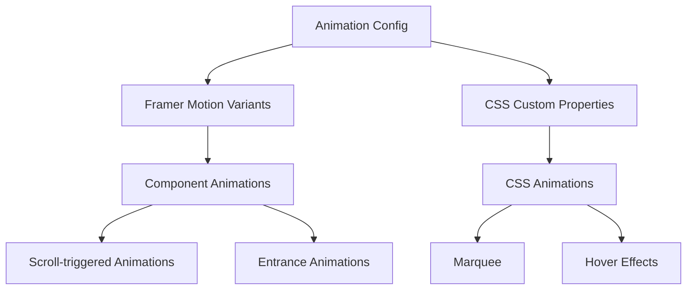

# Design Document: Visual Enhancements

## Overview

Данный дизайн описывает техническую реализацию визуальных улучшений для портфолио сайта, включая анимации появления элементов, бегущие строки (marquee), микро-анимации и другие интерактивные эффекты. Решение сохраняет существующий brutalism стиль и текущие анимации, добавляя новые визуальные эффекты для повышения привлекательности сайта.

### Design Goals

1. Сохранить все существующие анимации (кастомный курсор, hover эффекты кнопок)
2. Добавить плавные анимации появления для карточек проектов и принципов
3. Реализовать бегущие строки (marquee) с бесшовной анимацией
4. Обеспечить производительность 60 FPS на современных устройствах
5. Поддержать адаптивность и prefers-reduced-motion
6. Создать конфигурируемую систему анимаций

### Technology Stack

- **Animation Library**: Framer Motion (для декларативных анимаций и scroll triggers)
- **CSS Animations**: Нативные CSS animations для простых эффектов (marquee, hover)
- **Performance**: CSS transforms и opacity для GPU acceleration
- **Intersection Observer API**: Для определения видимости элементов при скролле

## Architecture

### Component Structure

```
components/
├── animations/
│   ├── Marquee.tsx              # Компонент бегущей строки
│   ├── FadeInWhenVisible.tsx    # HOC для анимации появления
│   └── AnimatedSection.tsx      # Wrapper для секций с анимациями
├── CustomCursor.tsx             # Существующий кастомный курсор (сохраняется)
├── ProjectCard.tsx              # Обновлен с анимациями
├── ManifestoCard.tsx            # Обновлен с анимациями
└── ...

styles/
├── animations/
│   ├── Marquee.module.css       # Стили для marquee
│   └── animations.module.css    # Общие анимации
└── ...

lib/
└── animations/
    ├── config.ts                # Конфигурация анимаций
    └── variants.ts              # Framer Motion variants
```

### Animation System Architecture

Система анимаций построена на трех уровнях:

1. **CSS Level**: Простые анимации (marquee, hover, transitions)
2. **Framer Motion Level**: Сложные анимации появления с scroll triggers
3. **Configuration Level**: Централизованная конфигурация параметров



## Components and Interfaces

### 1. Marquee Component

Компонент бегущей строки с бесшовной анимацией.

```typescript
interface MarqueeProps {
  items: string[];           // Элементы для отображения
  speed?: number;            // Скорость анимации (px/s), default: 50
  direction?: 'left' | 'right'; // Направление, default: 'left'
  pauseOnHover?: boolean;    // Пауза при наведении, default: false
  className?: string;
}

export default function Marquee({
  items,
  speed = 50,
  direction = 'left',
  pauseOnHover = false,
  className
}: MarqueeProps): JSX.Element
```

**Implementation Strategy**:
- Дублирование контента для создания бесшовного эффекта
- CSS animation с `animation-duration` рассчитанной на основе ширины контента
- `will-change: transform` для оптимизации

### 2. FadeInWhenVisible Component

HOC для анимации появления элементов при скролле.

```typescript
interface FadeInWhenVisibleProps {
  children: React.ReactNode;
  delay?: number;            // Задержка анимации (ms), default: 0
  duration?: number;         // Длительность (ms), default: 600
  threshold?: number;        // Intersection threshold, default: 0.1
  once?: boolean;            // Анимировать только один раз, default: true
  variant?: 'fadeIn' | 'slideUp' | 'slideLeft' | 'scale';
}

export default function FadeInWhenVisible({
  children,
  delay = 0,
  duration = 600,
  threshold = 0.1,
  once = true,
  variant = 'fadeIn'
}: FadeInWhenVisibleProps): JSX.Element
```

**Implementation Strategy**:
- Использование Framer Motion `motion` компонентов
- `useInView` hook для определения видимости
- Предопределенные variants для разных типов анимаций

### 3. AnimatedSection Component

Wrapper для секций с staggered анимациями дочерних элементов.

```typescript
interface AnimatedSectionProps {
  children: React.ReactNode;
  staggerDelay?: number;     // Задержка между элементами (ms), default: 100
  className?: string;
}

export default function AnimatedSection({
  children,
  staggerDelay = 100,
  className
}: AnimatedSectionProps): JSX.Element
```

**Implementation Strategy**:
- Framer Motion `staggerChildren` для последовательной анимации
- Автоматическое применение анимаций к дочерним элементам

### 4. Animation Configuration

Централизованная конфигурация всех параметров анимаций.

```typescript
// lib/animations/config.ts

export const animationConfig = {
  // Durations (ms)
  durations: {
    fast: 200,
    normal: 400,
    slow: 600,
    hero: 1500,
  },
  
  // Easing functions
  easing: {
    easeOut: [0.16, 1, 0.3, 1],
    easeIn: [0.7, 0, 0.84, 0],
    easeInOut: [0.87, 0, 0.13, 1],
    bounce: [0.68, -0.55, 0.265, 1.55],
  },
  
  // Stagger delays (ms)
  stagger: {
    cards: 100,
    buttons: 150,
    list: 50,
  },
  
  // Marquee speeds (px/s)
  marquee: {
    slow: 30,
    normal: 50,
    fast: 80,
  },
  
  // Intersection thresholds
  thresholds: {
    minimal: 0.1,
    half: 0.5,
    full: 1.0,
  },
} as const;

export type AnimationConfig = typeof animationConfig;
```

### 5. Framer Motion Variants

Предопределенные варианты анимаций для переиспользования.

```typescript
// lib/animations/variants.ts

import { Variants } from 'framer-motion';
import { animationConfig } from './config';

export const fadeInVariants: Variants = {
  hidden: { opacity: 0 },
  visible: {
    opacity: 1,
    transition: {
      duration: animationConfig.durations.normal / 1000,
      ease: animationConfig.easing.easeOut,
    },
  },
};

export const slideUpVariants: Variants = {
  hidden: { opacity: 0, y: 50 },
  visible: {
    opacity: 1,
    y: 0,
    transition: {
      duration: animationConfig.durations.normal / 1000,
      ease: animationConfig.easing.easeOut,
    },
  },
};

export const slideLeftVariants: Variants = {
  hidden: { opacity: 0, x: 50 },
  visible: {
    opacity: 1,
    x: 0,
    transition: {
      duration: animationConfig.durations.normal / 1000,
      ease: animationConfig.easing.easeOut,
    },
  },
};

export const scaleVariants: Variants = {
  hidden: { opacity: 0, scale: 0.8 },
  visible: {
    opacity: 1,
    scale: 1,
    transition: {
      duration: animationConfig.durations.normal / 1000,
      ease: animationConfig.easing.easeOut,
    },
  },
};

export const staggerContainerVariants: Variants = {
  hidden: { opacity: 0 },
  visible: {
    opacity: 1,
    transition: {
      staggerChildren: animationConfig.stagger.cards / 1000,
    },
  },
};
```

## Data Models

### Animation State

```typescript
interface AnimationState {
  isVisible: boolean;        // Элемент виден в viewport
  hasAnimated: boolean;      // Анимация уже проигралась
  isReducedMotion: boolean;  // Пользователь предпочитает меньше анимаций
}
```

### Marquee State

```typescript
interface MarqueeState {
  isPaused: boolean;         // Анимация на паузе
  animationDuration: number; // Рассчитанная длительность (s)
  contentWidth: number;      // Ширина контента (px)
}
```


## Correctness Properties

*A property is a characteristic or behavior that should hold true across all valid executions of a system-essentially, a formal statement about what the system should do. Properties serve as the bridge between human-readable specifications and machine-verifiable correctness guarantees.*

### Property 1: Existing animations preservation

*For any* existing animation (custom cursor, button hover effects), after implementing new visual enhancements, the animation should continue to function with the same behavior as before.

**Validates: Requirements 1.1, 1.2, 1.3**

### Property 2: Brutalism style consistency

*For any* page element, the visual styling should maintain brutalism design characteristics: yellow background (#ffd709), black borders (4px solid), and bold fonts (weight >= 700).

**Validates: Requirements 1.4**

### Property 3: Marquee seamless animation

*For any* marquee component, the content should be duplicated at least once in the DOM and animate continuously without visible gaps or pauses, with animation-iteration-count set to infinite.

**Validates: Requirements 2.2, 2.3, 2.5**

### Property 4: Marquee responsive speed

*For any* marquee component at different viewport widths, the animation speed (px/s) should remain consistent relative to the content width.

**Validates: Requirements 2.4**

### Property 5: Scroll-triggered entrance animations

*For any* card component (project or manifesto), when it enters the viewport (intersection ratio > threshold), an entrance animation should be triggered exactly once per page load.

**Validates: Requirements 3.1, 3.5, 5.1, 5.4**

### Property 6: Staggered animation delays

*For any* collection of animated elements (project cards, manifesto cards, hero buttons), each sequential element should have an incremental animation delay greater than the previous element.

**Validates: Requirements 3.2, 4.2, 5.2**

### Property 7: GPU-accelerated animations

*For any* animated element, the animation should only modify CSS properties that trigger GPU acceleration (transform, opacity, filter) and not layout-triggering properties (width, height, top, left, margin, padding).

**Validates: Requirements 3.3, 7.1**

### Property 8: Animation timing constraints

*For any* section with entrance animations, the total animation duration (including all stagger delays) should not exceed the specified maximum: 1500ms for hero section, 2000ms for other sections.

**Validates: Requirements 3.4, 4.3**

### Property 9: Reduced motion accessibility

*For any* animated element, when the user's prefers-reduced-motion setting is enabled, decorative animations should be disabled (duration set to 0 or animation removed) while essential UI feedback animations (hover, focus) should remain functional.

**Validates: Requirements 3.6, 8.4**

### Property 10: Visual variety in animations

*For any* two different section types (projects vs manifesto), the animation variants used should be different (e.g., slideUp vs fadeIn, or different easing functions).

**Validates: Requirements 5.3**

### Property 11: Hover micro-animations

*For any* interactive element (cards, buttons, navigation items, form inputs), hovering or focusing should apply a visual transformation (scale, translate, or color change) that completes within 300ms.

**Validates: Requirements 6.1, 6.2, 6.3, 6.4**

### Property 12: No setInterval for animations

*For any* animation implementation in the codebase, JavaScript setInterval or setTimeout should not be used for animation loops; instead, CSS animations, CSS transitions, or requestAnimationFrame should be used.

**Validates: Requirements 7.3**

### Property 13: Animation library code splitting

*For any* animation library dependency (Framer Motion), it should be dynamically imported or code-split to avoid including it in the initial bundle.

**Validates: Requirements 7.5**

### Property 14: Mobile animation simplification

*For any* resource-intensive animation, when viewport width is below 768px (mobile breakpoint), the animation should be simplified (reduced duration, fewer keyframes) or disabled.

**Validates: Requirements 8.2**

### Property 15: Responsive animation compatibility

*For any* animated component, when tested at viewport widths of 320px, 768px, 1024px, and 2560px, the animation should execute without errors or visual breaks.

**Validates: Requirements 8.3**

### Property 16: Centralized animation configuration

*For any* animation parameter (duration, easing, delay), the value should be defined in a centralized configuration file or CSS custom property, not hardcoded in component files.

**Validates: Requirements 9.2**

### Property 17: Configurable animation components

*For any* animation component (Marquee, FadeInWhenVisible, AnimatedSection), it should accept configuration props (duration, delay, easing) that allow customization of animation behavior.

**Validates: Requirements 9.3**

### Property 18: Smooth scroll behavior

*For any* anchor link navigation, the scroll behavior should be smooth (scroll-behavior: smooth in CSS or smooth scrolling via JavaScript).

**Validates: Requirements 10.2**

### Property 19: Section transition effects

*For any* major section boundary (hero to manifesto, manifesto to projects, etc.), a fade or slide transition effect should be applied when the section enters the viewport.

**Validates: Requirements 10.3**

### Property 20: Image loading animations

*For any* image element, a loading state (skeleton loader or fade-in animation) should be displayed while the image is loading, transitioning to the loaded state when complete.

**Validates: Requirements 10.5**


## Error Handling

### Animation Failures

1. **Intersection Observer Not Supported**
   - Fallback: Показывать элементы без анимаций
   - Detection: `if (!('IntersectionObserver' in window))`
   - Action: Рендерить компоненты в visible состоянии

2. **Framer Motion Load Failure**
   - Fallback: Использовать CSS анимации
   - Detection: Try-catch при динамическом импорте
   - Action: Рендерить статичный контент без анимаций

3. **CSS Animation Not Supported**
   - Fallback: Показывать статичный контент
   - Detection: Feature detection через `@supports`
   - Action: Применять fallback стили

### Performance Issues

1. **Low FPS Detection**
   - Monitor: Использовать Performance API для отслеживания frame rate
   - Threshold: Если FPS < 30 в течение 2 секунд
   - Action: Автоматически упрощать или отключать анимации

2. **Slow Device Detection**
   - Detection: `navigator.hardwareConcurrency < 4` или `navigator.deviceMemory < 4`
   - Action: Применять упрощенные анимации по умолчанию

### User Preferences

1. **Prefers Reduced Motion**
   - Detection: `@media (prefers-reduced-motion: reduce)` или `window.matchMedia`
   - Action: Отключать декоративные анимации, сохранять функциональные
   - Implementation: CSS media query + JavaScript hook

2. **Battery Saver Mode**
   - Detection: `navigator.getBattery()` API
   - Action: Упрощать анимации при низком заряде батареи

### Graceful Degradation Strategy

```typescript
// lib/animations/errorHandling.ts

export function getAnimationCapabilities() {
  return {
    intersectionObserver: 'IntersectionObserver' in window,
    cssAnimations: CSS.supports('animation', 'none'),
    transforms3d: CSS.supports('transform', 'translate3d(0,0,0)'),
    reducedMotion: window.matchMedia('(prefers-reduced-motion: reduce)').matches,
  };
}

export function shouldEnableAnimations(): boolean {
  const capabilities = getAnimationCapabilities();
  
  if (capabilities.reducedMotion) return false;
  if (!capabilities.cssAnimations) return false;
  
  return true;
}

export function getAnimationComplexity(): 'full' | 'simplified' | 'none' {
  const capabilities = getAnimationCapabilities();
  
  if (!shouldEnableAnimations()) return 'none';
  if (!capabilities.transforms3d) return 'simplified';
  
  // Check device performance
  const isMobile = window.innerWidth < 768;
  const isLowEnd = navigator.hardwareConcurrency && navigator.hardwareConcurrency < 4;
  
  if (isMobile || isLowEnd) return 'simplified';
  
  return 'full';
}
```

## Testing Strategy

### Dual Testing Approach

Тестирование визуальных улучшений будет использовать комбинацию unit тестов и property-based тестов:

- **Unit tests**: Проверка конкретных примеров, edge cases, и интеграционных точек
- **Property tests**: Проверка универсальных свойств анимаций на множестве входных данных

### Unit Testing Focus

Unit тесты будут сфокусированы на:

1. **Specific Examples**
   - Marquee компонент рендерится с заданными items
   - Hero секция имеет анимацию заголовка при загрузке
   - Конфигурационный файл существует и экспортирует правильную структуру

2. **Integration Points**
   - Framer Motion интегрируется корректно с React компонентами
   - Intersection Observer callback вызывается при видимости элемента
   - CSS модули применяются к компонентам

3. **Edge Cases**
   - Пустой массив items в Marquee компоненте
   - Отрицательные значения duration или delay
   - Очень большие значения stagger delay

4. **Error Conditions**
   - Intersection Observer не поддерживается браузером
   - Framer Motion не загружается
   - Invalid animation configuration values

### Property-Based Testing Focus

Property тесты будут проверять универсальные свойства:

1. **Animation Consistency**
   - Все анимации используют только GPU-accelerated свойства
   - Все staggered коллекции имеют монотонно возрастающие delays
   - Все timing constraints соблюдаются

2. **Accessibility**
   - Prefers-reduced-motion отключает декоративные анимации
   - Essential UI feedback сохраняется при reduced motion

3. **Responsive Behavior**
   - Анимации работают на всех viewport размерах
   - Mobile упрощения применяются корректно

4. **Configuration**
   - Все animation параметры берутся из конфигурации
   - Все компоненты принимают configuration props

### Property-Based Testing Configuration

- **Library**: fast-check (уже установлен в проекте)
- **Iterations**: Минимум 100 итераций на тест
- **Tag Format**: `Feature: visual-enhancements, Property {number}: {property_text}`

### Test Structure

```typescript
// __tests__/properties/visual-enhancements/animations.property.test.ts

import fc from 'fast-check';

describe('Feature: visual-enhancements', () => {
  describe('Property 7: GPU-accelerated animations', () => {
    it('should only animate GPU-accelerated properties', () => {
      // Feature: visual-enhancements, Property 7: GPU-accelerated animations
      
      fc.assert(
        fc.property(
          fc.record({
            opacity: fc.double(0, 1),
            translateX: fc.integer(-1000, 1000),
            translateY: fc.integer(-1000, 1000),
            scale: fc.double(0.1, 2),
          }),
          (animationProps) => {
            // Test that animation only uses transform and opacity
            const allowedProps = ['opacity', 'transform'];
            const usedProps = Object.keys(animationProps);
            
            return usedProps.every(prop => 
              allowedProps.includes(prop) || 
              prop.startsWith('translate') || 
              prop === 'scale'
            );
          }
        ),
        { numRuns: 100 }
      );
    });
  });
});
```

### Testing Checklist

**Unit Tests:**
- [ ] Marquee component renders with items
- [ ] Marquee duplicates content for seamless loop
- [ ] FadeInWhenVisible triggers animation on intersection
- [ ] AnimatedSection applies stagger to children
- [ ] Animation config exports correct structure
- [ ] Variants export correct Framer Motion format
- [ ] Reduced motion disables animations
- [ ] Mobile breakpoint simplifies animations
- [ ] Error handling for unsupported features
- [ ] Smooth scroll behavior applied

**Property Tests:**
- [ ] Property 1: Existing animations preservation
- [ ] Property 2: Brutalism style consistency
- [ ] Property 3: Marquee seamless animation
- [ ] Property 4: Marquee responsive speed
- [ ] Property 5: Scroll-triggered entrance animations
- [ ] Property 6: Staggered animation delays
- [ ] Property 7: GPU-accelerated animations
- [ ] Property 8: Animation timing constraints
- [ ] Property 9: Reduced motion accessibility
- [ ] Property 10: Visual variety in animations
- [ ] Property 11: Hover micro-animations
- [ ] Property 12: No setInterval for animations
- [ ] Property 13: Animation library code splitting
- [ ] Property 14: Mobile animation simplification
- [ ] Property 15: Responsive animation compatibility
- [ ] Property 16: Centralized animation configuration
- [ ] Property 17: Configurable animation components
- [ ] Property 18: Smooth scroll behavior
- [ ] Property 19: Section transition effects
- [ ] Property 20: Image loading animations

### Manual Testing

Некоторые аспекты требуют ручного тестирования:

1. **Visual Quality**
   - Плавность анимаций на реальных устройствах
   - Отсутствие визуальных артефактов
   - Соответствие дизайну

2. **Performance**
   - 60 FPS на современных устройствах
   - Отсутствие jank при множественных анимациях
   - Время загрузки страницы

3. **Cross-browser Compatibility**
   - Chrome, Firefox, Safari, Edge
   - Mobile browsers (iOS Safari, Chrome Mobile)

4. **Accessibility**
   - Screen reader compatibility
   - Keyboard navigation не блокируется анимациями
   - Reduced motion работает корректно

## Implementation Notes

### Phase 1: Foundation (Priority: High)

1. Установить Framer Motion: `npm install framer-motion`
2. Создать animation configuration (`lib/animations/config.ts`)
3. Создать Framer Motion variants (`lib/animations/variants.ts`)
4. Создать error handling utilities (`lib/animations/errorHandling.ts`)

### Phase 2: Core Components (Priority: High)

1. Создать Marquee компонент
2. Создать FadeInWhenVisible HOC
3. Создать AnimatedSection wrapper
4. Добавить CSS animations для marquee

### Phase 3: Integration (Priority: Medium)

1. Обновить ProjectCard с анимациями
2. Обновить ManifestoCard с анимациями
3. Добавить анимации в Hero секцию
4. Добавить hover эффекты

### Phase 4: Polish (Priority: Low)

1. Добавить parallax эффекты
2. Добавить loading animations для изображений
3. Добавить section transitions
4. Оптимизировать производительность

### Performance Optimization Tips

1. **Use CSS Animations Where Possible**
   - Простые анимации (marquee, hover) - CSS
   - Сложные анимации (scroll-triggered) - Framer Motion

2. **Lazy Load Framer Motion**
   ```typescript
   const MotionDiv = dynamic(() => 
     import('framer-motion').then(mod => mod.motion.div),
     { ssr: false }
   );
   ```

3. **Use will-change Sparingly**
   - Применять только к активно анимируемым элементам
   - Удалять после завершения анимации

4. **Optimize Intersection Observer**
   - Использовать один observer для всех элементов
   - Установить подходящий threshold (0.1 для большинства случаев)

5. **Debounce Resize Handlers**
   - Если анимации зависят от размера viewport
   - Использовать debounce для пересчета

### Browser Support

- **Modern Browsers**: Full support (Chrome 90+, Firefox 88+, Safari 14+, Edge 90+)
- **Older Browsers**: Graceful degradation (показывать контент без анимаций)
- **Mobile**: Simplified animations на устройствах с низкой производительностью

### Accessibility Considerations

1. **Prefers Reduced Motion**: Обязательная поддержка
2. **Keyboard Navigation**: Анимации не должны блокировать навигацию
3. **Screen Readers**: Анимации не должны мешать чтению контента
4. **Focus Management**: Анимации не должны сбрасывать фокус

## Conclusion

Данный дизайн обеспечивает комплексное решение для добавления визуальных улучшений в портфолио сайт, сохраняя существующий brutalism стиль и анимации. Использование Framer Motion для сложных анимаций и CSS для простых эффектов обеспечивает баланс между функциональностью и производительностью. Централизованная конфигурация и error handling гарантируют maintainability и graceful degradation на старых устройствах.
